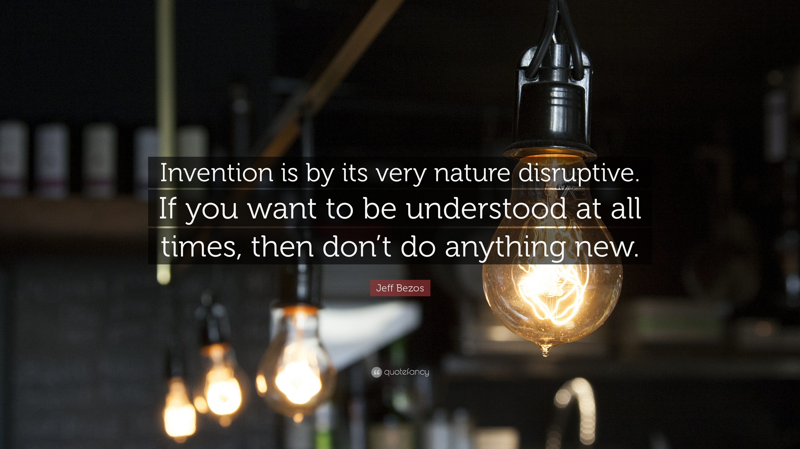

## Hi there 👋

<!--
**AbdallahZerfaoui/AbdallahZerfaoui** is a ✨ _special_ ✨ repository because its `README.md` (this file) appears on your GitHub profile.

Here are some ideas to get you started:
- 🔭 I’m currently working on ...
- 🌱 I’m currently learning ...
- 👯 I’m looking to collaborate on ...
- 🤔 I’m looking for help with ...
- 💬 Ask me about ...
- 📫 How to reach me: ...
- 😄 Pronouns: ...
- ⚡ Fun fact: ...
-->

- 🔭 I’m currently turning **applied mathematics** into real-world solutions—whether it’s crunching numbers or simulating complex systems.  
- 🌱 I’m honing my **C**, **C++**, and **Python** skills to tackle any challenge that needs a solid calculation approach.  
- 👯 I’m looking to collaborate on projects where **problem-solving** is key: from algorithm optimization to high-performance computing.  
- 🤔 I’m ready to jump into any domain that demands analytical thinking, from mechanical engineering to pure data science.  
- 💬 Ask me about diving deep into **matrices**, speeding up **numerical methods**, or the best way to handle **high-performance** code.  
- ⚡ Fun fact: If there’s a problem that needs maths, I’ll be there, debugging and iterating until it’s solved!

<h3 align="left">Languages and Tools:</h3>

  
  
   
   
    
   
   
   
   
  <!-- Line 3: ML & Data Science -->
   
  
  
  
  
  <!-- Line 4: Engineering, Simulation & CAD -->
<!--     -->
<!--    -->

&nbsp;

<h3 align="left">Project-driven methodology of 42 Heilbronn:</h3>

  <ul>
    <li> <a href="https://github.com/AbdallahZerfaoui/Philosophers" target="_blank">Philosophers</a> </li>
    <li> <a href="https://github.com/AbdallahZerfaoui/Minishell" target="_blank">Minishell</a> </li>
    <li> <a href="https://github.com/AbdallahZerfaoui/Cub3D" target="_blank">Cub3D</a> </li>
    <li> <a href="https://github.com/AbdallahZerfaoui/IRC.git" target="_blank">IRC</a> </li>
  </ul>

<h3 align="left">Applied mathematics:</h3>

  <ul>
    <li> <a href="https://github.com/AbdallahZerfaoui/HeatEquationSolver.git" target="_blank">HeatEquationSolver</a> </li>
    
  </ul>

<h3 align="left">Games:</h3>

  <ul>
    <li> <a href="https://github.com/AbdallahZerfaoui/PokerCalculator" target="_blank">PokerCalculator</a> </li>
    <li> <a href="https://github.com/AbdallahZerfaoui/LabyrintheParfait" target="_blank">PerfectMaze</a> </li>
    
  </ul>

<h3 align="left">Tools for 42 Students:</h3>

  <ul>
    <li> <a href="https://github.com/AbdallahZerfaoui/42PhilosophersHelper" target="_blank">42PhilosophersHelper</a> </li>
    <li> <a href="https://github.com/AbdallahZerfaoui/CPPs_classes_scripting.git" target="_blank">Automating C++ Class Creation</a> </li>
  </ul>

  

