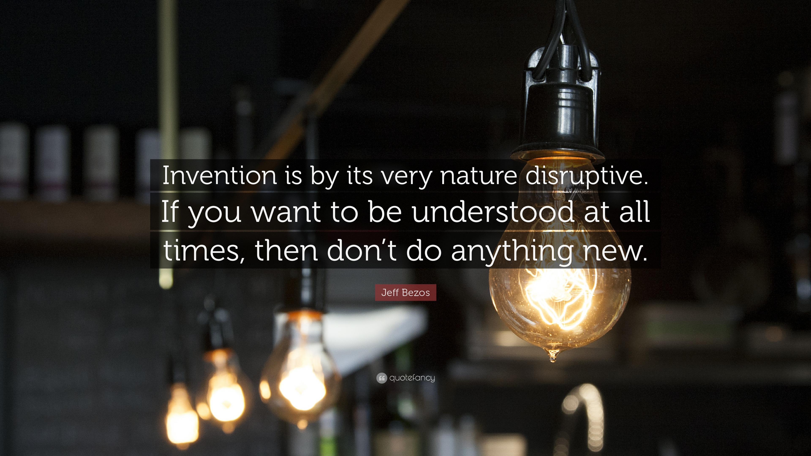

<!--

  

-->

<!-- =============================== -->
<!-- 🌌 Animated Matrix Background -->
<!-- =============================== -->

# Hi, I'm Abdallah. 👋

### Junior Cloud Engineer | Former Aeronautical Engineer (7 Years)

I am an engineer transitioning from high-precision aerospace systems to **Cloud Infrastructure**. 
My background in **Finite Element Analysis** (Safran/Nenuphar) taught me that system failure is not an option, it's a design constraint. I am now applying that same rigor to building reliable, scalable cloud solutions.

I am not just looking to write code; I am looking to build and maintain the infrastructure that code runs on.

---

### ☁️ Cloud & Systems Stack
* **Core:** Python (Automation/APIs), C/C++ (System proficiency), Bash.
* **Infrastructure:** Docker, Linux Systems, CI/CD Pipelines.
* **Interests:** Cloud Native technologies, Distributed Systems, High Availability.

### ⚙️ Engineering Mindset
I bring a senior engineer's discipline to a junior cloud role:
* **Deep Linux Understanding:** Through 42 School, I rebuilt shells and handled low-level concurrency (Mutex/Threads). I don't just use the OS; I understand it.
* **Automate Everything:** If I have to do it twice, I script it.
* **Defensive Design:** I anticipate failure modes. My code is type-hinted, tested, and built to crash safely rather than fail silently.

### 🔭 Current Focus
* Deepening knowledge in **Cloud Infrastructure** and **Container Orchestration**.
* **[Kiwi-Flight-Engine](https://github.com/AbdallahZerfaoui/kiwi-flight-engine)**: A containerized flight search service using Async I/O (FastAPI).
* **Systems Programming**: Low-level resource management and concurrency control in C.

---

<!-- LANGUAGES -->
<h3>Languages</h3>

  

<!-- Tools & Platforms -->
<h3>Tools & Platforms</h3>

  
  
  
  

<!-- DATABASES -->
<h3>Databases & Message Brokers</h3>

  
  
  
  
  
  

<!-- DEVOPS -->
<h3>DevOps & Cloud</h3>

  
  
  
  
  
  

<!-- ML / DATA -->
<h3>Data & ML</h3>

  
  
  
  

<!-- Frameworks & Libraries -->
<h3>Frameworks & Libraries</h3>

  
  
  

<!-- STATS -->

  

<!-- SNAKE -->  

  

<h3 align="left">Project-driven methodology of 42 Heilbronn:</h3>

  <ul>
    <li> <a href="https://github.com/AbdallahZerfaoui/thread-safe-resource-allocator" target="_blank">thread-safe-resource-allocator</a> </li>
    <li> <a href="https://github.com/AbdallahZerfaoui/linux-process-interpreter" target="_blank">linux-process-interpreter</a> </li>
    <li> <a href="https://github.com/AbdallahZerfaoui/Cub3D" target="_blank">Cub3D</a> </li>
    <li> <a href="https://github.com/AbdallahZerfaoui/IRC.git" target="_blank">IRC</a> </li>
    <li> <a href="https://github.com/AbdallahZerfaoui/Inception.git" target="_blank">Inception</a> </li>
  </ul>

<h3 align="left">Applied mathematics:</h3>

  <ul>
    <li> <a href="https://github.com/AbdallahZerfaoui/HeatEquationSolver.git" target="_blank">HeatEquationSolver</a> </li>
    
  </ul>

<h3 align="left">Games:</h3>

  <ul>
    <li> <a href="https://github.com/AbdallahZerfaoui/PokerCalculator" target="_blank">PokerCalculator</a> </li>
    <li> <a href="https://github.com/AbdallahZerfaoui/LabyrintheParfait" target="_blank">PerfectMaze</a> </li>
    
  </ul>

<h3 align="left">Tools for 42 Students:</h3>

  <ul>
    <li> <a href="https://github.com/AbdallahZerfaoui/42PhilosophersHelper" target="_blank">42PhilosophersHelper</a> </li>
    <li> <a href="https://github.com/AbdallahZerfaoui/CPPs_classes_scripting.git" target="_blank">Automating C++ Class Creation</a> </li>
  </ul>

  

